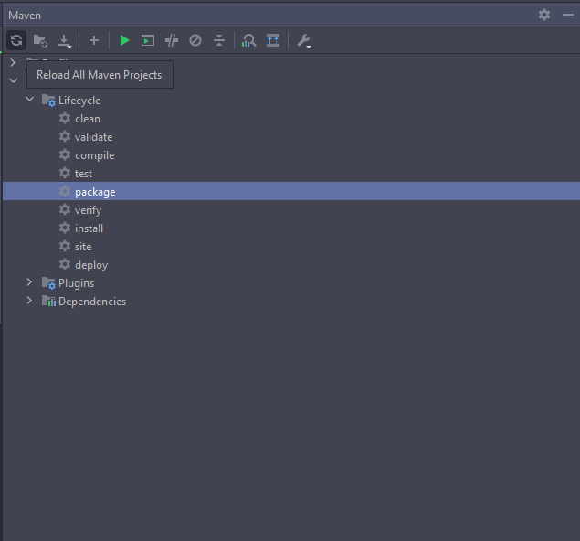

# VollMed - Backend

Essa aplicação foi desenvolvida utilizando Java Spring e Spring MVC para criação do servidor, Spring Data JPA para manipulação e persistência de dados, Lombok para geração de boilerplates e MySQL Driver para realizar a conexão com banco de dados MySQL.

<h2>Requisitos</h2>

É necessário ter o Java instalado na sua máquina

<h2>Instalando o projeto</h2>

Primeiro você deve clonar o repositório,

```bash
# Clone o repositório
$ git clone https://github.com/henrylacava/backend-vollmed-api.git

# Acesse-o
$ cd backend-vollmed-api
```

Agora, dentro do IntelliJ, vamos instalar as depedências com o Maven



Entre no arquivo da classe `ApiApplication` para executar o projeto


